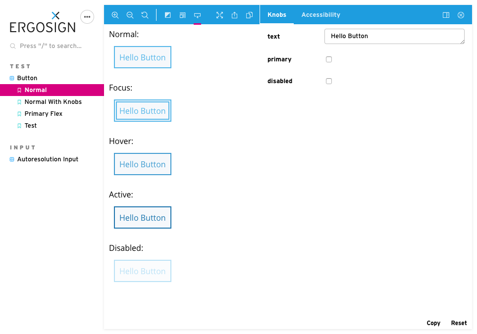

# Storybook Addon Pseudo States

Storybook Addon Pseudo States allows you to automatically display pseudo states (and attribute states) of a component in Storybook's preview area.

This is how it looks like:

## Framework Support

| Framework | Display States | Tool-Button to show/hide |
| --------- | :------------: | :----------------------: |
| Angular   |       +        |           +\*            |
| React     |       +        |           +\*            |
| Lit-HTML  |       +        |           +\*            |
| HTML      |       +        |           +\*            |
| Vue       |       +        |           +\*            |

\* Could lead to sync problems with other addons, like knobs

## Installation & Usage

- [Angular](./src/angular/README.md)
- [React](./src/react/README.md)
- [Lit-Html](./src/lit/README.md)
- [Html](./src/html/README.md)
- [Vue](./src/vue/README.md)
