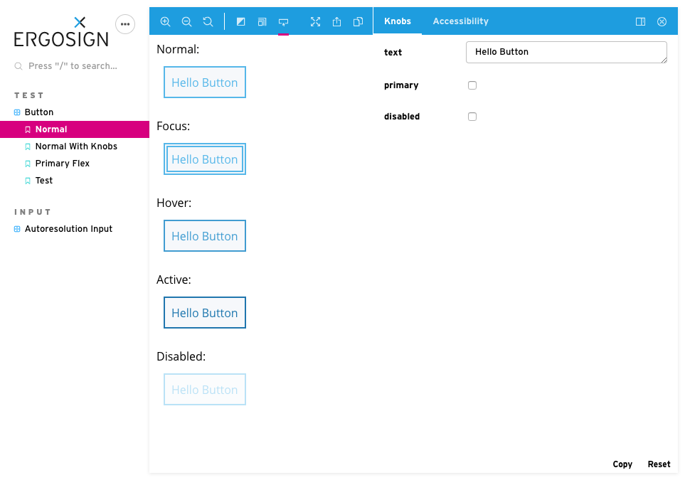

# Storybook Addon Pseudo States

Storybook Addon Pseudo States allows you to automatically display pseudo states (and attribute states) of a component in Storybook's preview area.

- <a href="https://philippone.github.io/create-react-app-storybook-addon-pseuo-states/" target="_blank">Live-Demo</a>
- <a href="https://github.com/philippone/create-react-app-storybook-addon-pseuo-states" target="_blank">Example Repo (CRA)</a>




## Framework Support

| Framework | Display States | Tool-Button to show/hide |
| --------- | :------------: | :----------------------: |
| Angular   |       +        |           +              |
| React     |       +        |           +              |
| Lit       |       +        |           +              |
| HTML      |       +        |           +              |
| Vue       |       +        |           +              |


## Getting started

First of all, you need to install Pseudo States into your project as a dev dependency.

```sh
npm install @ergosign/storybook-addon-pseudo-states-react --save-dev
```

When using *create-react-app* and the related preset, configure it as an addon
for your Storybook environment (located in the Storybook config directory).

<details>
<summary>For version < 5.3.x</summary>

Import the addon in your *addons.js* file:

```js
import "@ergosign/storybook-addon-pseudo-states-react/preset-postcss";
```

</details>

<details>
<summary>For version >= 5.3.x</summary>

Add it to the *addons* section in your *main.js* file.

```js
module.exports = {
  "addons": [
    '@ergosign/storybook-addon-pseudo-states-react/preset-postcss'
  ]
}
```

</details>

In case you have an other project configuration, check out the [Advanced setup](#advanced-settup)
section, to see how to get it working with different settings.

To see what's needed to use the pseudo addon, have a look at the [Usage](#usage) section.

### Advanced setup

#### With PostCSS Preset

> This project comes with a dependency to the [postcss-pseudo-classes](https://github.com/giuseppeg/postcss-pseudo-classes) package.
> Unfortunately, the latest version is only tagged and not released.

We provide a *preset-postcss* preset that adds [postcss-loader](https://github.com/postcss/postcss-loader) to Storybook's custom webpack config.
Add this preset to your configuration (located in the Storybook config directory)

<details>
<summary>For version < 5.3.x</summary>

Import the addon in your *addons.js* file:

```js
import "@ergosign/storybook-addon-pseudo-states-react/preset-postcss";
```

</details>

<details>
<summary>For version >= 5.3.x</summary>

Add it to the *addons* section in your *main.js* file.

```js
module.exports = {
  "addons": [
    '@ergosign/storybook-addon-pseudo-states-react/preset-postcss'
  ]
}
```

</details>

This creates for each css pseudo class an equivalent as normal css class (for instance `:hover` to `\:hover`), so that 
you can use it in element's class attribute (`<div class=":hover">Element in hover state</div>`).

You can modify post css loader options (see type definition of [PseudoStatesPresetOptions](../share/preset-utils.ts)):

```js
module.exports = {
   presets: [
       {
            name:"@ergosign/storybook-addon-pseudo-states-react/preset-postcss",
            options: {
                rules: [/\.scss$|\.sass$/, ".sass", ...],
                cssLoaderOptions: CssLoaderOptions,
                postCssLoaderPseudoClassesPluginOptions: {
                    prefix: 'pseudo-sates--', // default for angular
                    blacklist: [':nth-child', ':nth-of-type']
                }
            }
        }     
    ] 
}
```

If you set another prefix you have to set the same for the addon, too. 
Therefore, add the following to your `.storybook/preview.js`:

```js
addParameters({
    withPseudo: {
        prefix: "still-pseudo-states--",
    },
});
```

#### Own Webpack config (but automatically generated with PostCss)

When you have configured your own webpack config but still want to use this addon
with PostCSS, add [postcss-loader](https://github.com/postcss/postcss-loader) to you
webpack config.

> **ATTENTION**:
> When using CSS-Modules, you have to take care that no `[hash]` is used as *localIdentName*
> in your *css-loader* options.

```js
module.exports = {
  module: {
    rules: [
      {
        test: /\.(scss|css)$/,
        use: [
          {
            loader: 'style-loader',
          },
          {
            loader: 'css-loader',
            options: {
              // ATTENTION when using css modules
              modules: {
                // !!! must not use [hash]'
                localIdentName: '[path][name]__[local]',
              },
            },
          },
          // Add loader here
          {
            loader: 'postcss-loader',
          },
          {
            loader: 'sass-loader',
          },
        ],
      },
    ],
  },
};
```

Aditionally, you have to enable the postcss-peudo-classes module it your `postcss.config.js`

```js
module.exports = {
  plugins: {
    'postcss-pseudo-classes': {
      // prefix: 'pseudoclass--',
    },
  },
};
```

<details>
<summary>When using a custom `prefix` parameter, use the same for postcss-pseudo-classes</summary>

```js
module.exports = {
  plugins: {
    'postcss-pseudo-classes': {
      prefix: 'pseudoclass-example-prefix',
    },
  },
};
```

</details>

#### Manually

When you do not want that the pseudo classes are generated for you, you can provide
your own rule on which the plugin looks for your css classes.

Per default, the prefix used in the addon to look for css classes is `\:`.
To add the needed styles you have to add fakle classes consisting of `prefix` + `pseudostate` by yourself.

For example: When you want the *hover* and *focus* states to be shown by the plugin, you
have to add `\:hover` and `\:focus` classes to your styles by yourself.

For the default prefix this may look like this:

```scss
.element {
  //element styling

  &:hover,
  &\:hover {
    // hover styling
  }
}
```

<details>
<summary>With a custom prefix</summary>

If you want to specify your own prefix, set it as *prefix* value in the addons *parameters* object.

To change the prefix to `.pseudoclass--` you have to adjust the parameter like this:

```js
// in your story
parameters: {
    withPseudo: {
        selector: "element",
        prefix: "pseudoclass--"
    }
}
```

And use the specified prefix in your styling definition:

```scss
.element {
  //element styling

  &:hover,
  &.pseudoclass--hover {
    // hover styling
  }
}
```

</details>

### Show/Hide Toolbar-Button

You can enable a toolbar button that toggles the Pseudo States in the Preview area.

See [Framework Support](#framework-support) which Frameworks support this feature.

Enable the button by adding it to your addon configuration file (located in the Storybook config directory)

<details>
<summary>For version < 5.3.x</summary>

Import the addon in your *addons.js* file:

```js
import "@ergosign/storybook-addon-pseudo-states-react/register";
```
</details>

<details>
<summary>For version >= 5.3.x</summary>

Add it to the *addons* section in your *main.js* file.

```js
module.exports = {
  "addons": [
    '@ergosign/storybook-addon-pseudo-states-react/register'
  ]
}
```

</details>

### Usage

> **WARNING**: `withPseudo` should always the first element in your `decorators` array because it alters the template of the story.

#### General

##### Component Story Format (CSF, recommended)

```js
import { withPseudo } from '@ergosign/storybook-addon-pseudo-states-react';

const section = {
  title: 'Button',
  decorators: [withPseudo],
  parameters: {
    withPseudo: { selector: 'button' },
  },
};
export default section;

export const Story = () => {
  return {
    component: ButtonComponent,
  };
};
```

##### storyOf Format

```js
import { withPseudo } from '@ergosign/storybook-addon-pseudo-states-react';

storiesOf('Button', module)
  .addDecorator(withPseudo)
  .addParameters({
    withPseudo: {
      selector: 'button', // css selector of pseudo state's host element
      pseudo: ['focus', 'hover', 'hover & focus', 'active'],
      attributes: ['disabled', 'readonly', 'error'],
    },
  })
  .add('Icon Button', () => <Button />);
```

There is a default configuration for `selector`, `pseudos` and `attributes`. Thus, you can leave `withPseudo` options empty.

#### Parameters & Types

See [Types](../share/types.ts)
